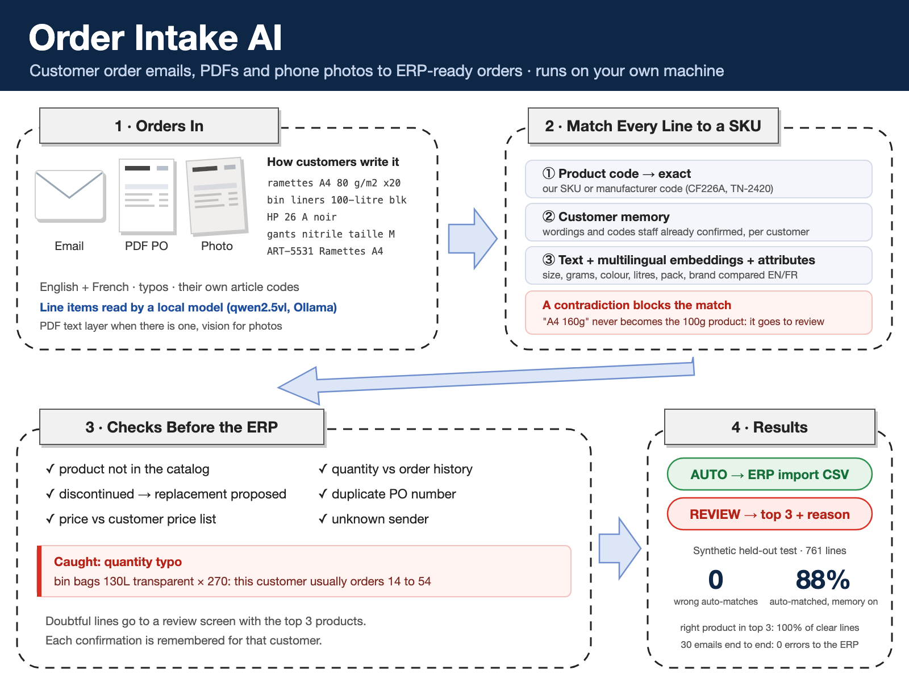
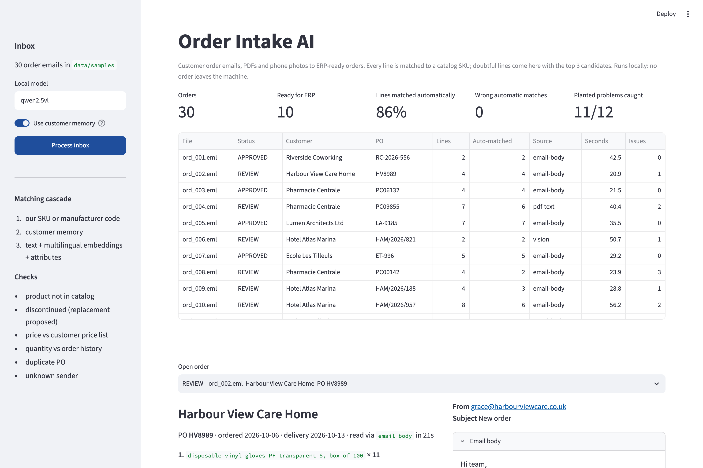
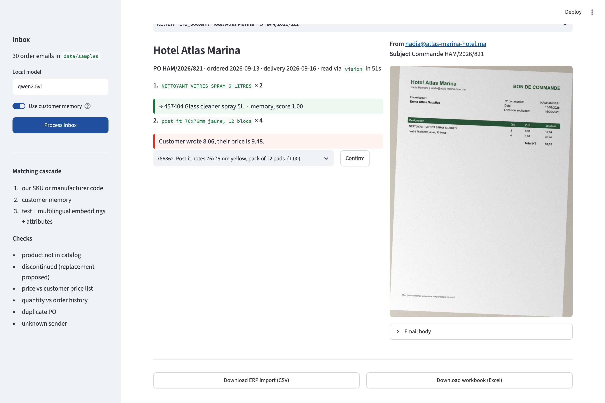

# Order Intake AI

Customer order emails, PDF purchase orders and phone photos turned into **ERP-ready orders**, with every line matched to a product in your catalog. Runs locally: no order is sent to OpenAI or any cloud API.

The model reads. A matcher finds the SKU. Code checks prices, quantities and duplicates. A person decides on anything uncertain, and the system remembers the decision.



## Why this problem

Distributors and wholesalers receive orders as emails, PDFs and photos, written in the customer's own words: `ramettes A4 80 g/m2 x20`, `bin liners 100-litre blk`, `HP 26 A noire`, `ART-5531 Ramettes A4`. Someone looks up each line in the catalog and retypes it into the ERP. The reading is the easy part. The costly part is **the near miss**: A4 90g instead of 80g, gloves size L instead of M, toner 26X instead of 26A. They look almost identical as text, and they come back as returns.

So the matcher is built around one rule: **never auto-match a line it could get wrong.** A contradicted attribute (customer wrote 160g, product is 100g) cuts the score hard, and a line is only matched automatically when the best product clearly beats the runner-up. Everything else goes to a person with the top 3 candidates.

## Results

All data is synthetic (see [How the test data is made](#how-the-test-data-is-made)). Thresholds were tuned on a dev batch and frozen before any held-out run.

### Matching (order lines as the customer wrote them)

283-product bilingual catalog, 12 customers.

| | Dev batch (seed 1) | **Held-out (seed 2027)** | **Held-out + customer memory** |
|---|---|---|---|
| Order lines | 689 | **761** | **761** |
| Lines matched automatically | 77.1% | **75.3%** | **87.9%** |
| Wrong automatic matches | 0 | **0** | **0** |
| Right product ranked first (clear lines) | 99.5% | **98.5%** | **99.4%** |
| Right product in top 3 (clear lines) | 100% | **100%** | **100%** |
| Not-in-catalog near misses auto-matched | 0/12 | **0/12** | **0/12** |

- **Clear lines** name enough to identify one product. About 17% of lines don't: the customer left out the brand and two brands sell the same spec (`A3 80g paper`, `lever arch file A4 80mm black`). Those go to review on first sight. After a person picks once, the customer memory resolves them on the next order.
- **Customer memory** holds the wordings and article codes staff confirmed for each customer in past orders (here: the dev batch). Repeat orders are most of a distributor's volume, so this is where the automation rate comes from.
- The held-out wording uses phrases never seen while building the matcher: `bin liners`, `refuse sacks`, `LR6`, `5 cm`, `medium`, `papier reprographie`, `marqueur velleda`.
- A first held-out run (seed 2026) exposed a parsing bug (`50-litre` with a hyphen) and the dev batch showed that brand, glove sizes and envelope closures weren't parsed. Those were fixed using dev-batch errors only, and the table above is a fresh seed run afterwards.

Reproduce: `uv run python -m order_intake_ai eval-matching` (about a minute, no LLM).

### End to end (emails in, ERP lines out, local model)

Local run on an Apple M1 (16 GB), qwen2.5vl 7B via Ollama, temperature 0, customer memory on.

| | Dev inbox (seed 2028), first run | Dev inbox after fixes | **Held-out inbox (seed 2029)** |
|---|---|---|---|
| Order emails | 30 (14 body, 13 PDF, 3 photo) | 30 | **30 (20 body, 2 PDF, 8 photo)** |
| Order lines found | 145/145 | 145/145 | **140/140** |
| PO number / order date / delivery date | 87% / 100% / 87% | 100% / 100% / 100% | **100% / 100% / 100%** |
| Quantity / unit price read correctly | 98.6% / 100% | 98.6% / 100% | **95.7% / 100%** |
| Lines matched automatically | 86.2% | 86.9% | **86.4%** |
| Wrong automatic matches | 0 | 0 | **0** |
| Orders approved for the ERP | 11 | 10 | **10** |
| Approved orders with any error | 4 | 0 | **0** |
| Planted problems sent to review | 10/12 | 11/12 | **11/12** |
| Avg time: email body / PDF / photo | 54 / 73 / 106 s | | **37 / 32 / 87 s** |

How these numbers were made:
- The dev inbox was used to build the pipeline. Its first run let 4 orders through with an error: the PO cleaner cut `PO-2026-03080` to `-2026-03080` (2 orders), the model put the PO's only date in the delivery-date field, and in `1 feutre permanent fine bleus, 12 par boite` it read the pack size as the quantity. Fixes, each with a unit test: keep `PO-` prefixes, keep a delivery date only if the document has delivery wording, and flag a line whose leading number disagrees with the quantity. The dev inbox was then re-scored from the cached model output; the first-run report is kept in `out/dev/report_run1.json`.
- The held-out inbox was generated with a new seed after those fixes and run once, untouched.
- Known gaps, from the held-out run:
  - In one email the model shifted quantities between lines (6 wrong). The order went to review because 3 of those lines were flagged, but the other 3 had no flag of their own, so a reviewer has to check every line of a flagged email, not only the red ones.
  - The one missed planted problem was an outdated price on a line that was already in review for an unclear product. The price check needs a matched product, so it doesn't run on lines still waiting for a person to pick one.




## How it decides

**1. Code.** If a line quotes one of our SKUs or a manufacturer part number (`CF226A`, `TN 2420`, `L7160`), that is the product.

**2. Customer memory.** If staff already confirmed this exact wording or article code for this customer, use it. Memory is per customer: `paper A4` from a law firm and from a school can mean different products.

**3. Hybrid score over the whole catalog.**
- fuzzy text similarity against the English and French product names
- multilingual sentence embeddings (`paraphrase-multilingual-MiniLM-L12-v2`, runs locally)
- attribute agreement: size, grams, colour, litres, mm, pack size, brand, toner model, glove size, envelope window and closure. Parsed the same way on both sides, so `80 g/m2` = `80gsm` = `80g`, `5 cm` = `50mm`, `LR6` = `AA`, `noire` = `black`.
- each contradicted attribute multiplies the score by 0.35

A line is matched automatically only if `score ≥ 0.40` **and** it beats the runner-up by `≥ 0.09`. Both thresholds were picked on the dev batch as the setting with the most automatic matches and zero wrong ones.

## Checks before the ERP

Messages below are copied from the dev run.

| Check | Example flag |
|---|---|
| Unclear product | `wireound notebook A5 lined 100 pages` → Pick the product: close alternatives (Clairefontaine spiral notebook A5 lined 100 pages) |
| Discontinued | Candidate 937084 is discontinued. Replacement: 858714 Clairefontaine spiral notebook A5 lined 100 pages |
| Not in catalog | No product close enough in the catalog. New item, or a product we don't sell? |
| Price | `Leitz arch file A4 80mm yellow` → Customer wrote 3.94, their price is 3.52. |
| Quantity vs history | `12a toner cartridge black` → Ordered 10; usually 1 to 2. Typo? |
| Quantity unclear | `1 feutre permanent fine bleus, 12 par boite` → Line starts with 1 but quantity was read as 12. Check the quantity. |
| Duplicate PO | PO ET-263 was already received from this customer. Duplicate order? |
| Order header | unknown sender, missing PO, delivery date before order date |

## How the test data is made

`order_intake_ai.synth` generates a catalog, customers, order history and orders with ground truth for every line.

- **Catalog:** 283 office and janitorial products in families of near-identical siblings (paper by brand, size and grammage; pens by model and colour; gloves by material, colour and size; toner A vs X; bin bags by litres and colour; envelopes by format, window and closure). A few are discontinued, with a same-spec replacement.
- **Customers:** 12 (6 French-speaking, 6 English-speaking), each with habitual products written the same way every time, a discount, an order format (email, PDF, photo) and sometimes their own article codes.
- **Wording:** synonyms, French or English, abbreviations (`blk`, `bte`, `pk`), dropped brand or pack size, attribute formats, typos, upper or lower case.
- **Planted problems:** quantity typos (x10), outdated prices, discontinued products, near-miss products that are not in the catalog (A4 160g, gloves XXL, bin bags 240L, HP 30A, Bic Cristal purple), duplicate PO numbers.
- **Documents:** `.eml` files with the order in the body, or a PDF purchase order attached (French or English layout), or a phone photo of it (rotation, uneven light, blur, noise, JPEG).

Synthetic data keeps the repo free of anyone's real orders. Real orders are messier: handwriting, multi-page POs, products described by use ("the blue pens we always get"). That is why every doubtful line goes to a person, and why a real project starts with a test on your own orders and your own catalog.

## Run it

```bash
ollama pull qwen2.5vl                              # local model
uv sync                                            # install

uv run python -m order_intake_ai setup             # catalog, customers, thresholds, memory, sample inbox
uv run python -m order_intake_ai eval-matching     # line-level matching test (no LLM)
uv run python -m order_intake_ai run               # inbox -> out/erp_import.csv, out/orders.xlsx, out/report.json
uv run streamlit run app.py                        # review screen (localhost only)

uv run pytest -q
```

## Layout

```
src/order_intake_ai/
  catalog.py    product catalog (EN/FR names, attributes, prices, discontinued + replacement)
  text.py       normalization and attribute parsing, same on catalog and order lines
  match.py      code -> customer memory -> hybrid score; confidence gate; Memory
  extract.py    .eml reading, source routing, local model call (raw strings only), number/date/PO cleanup
  checks.py     line and order checks -> APPROVED / REVIEW
  pipeline.py   inbox run with caching
  export.py     ERP import CSV/JSON + Excel workbook
  evaluate.py   line metrics, threshold tuning, end-to-end metrics
  synth.py      customers, wording, orders, planted problems, ground truth
  render.py     .eml + PDF purchase orders + phone photos
app.py          Streamlit review screen
```

## Author

Said Ibenariba, data scientist and AI engineer. I took a vision-language invoice model to production at Orange Business (1,000+ carrier invoice formats, FastAPI + Docker, air-gapped). See also [Private Invoice AI](https://github.com/SaidIbenariba/private-invoice-ai). Available for document-processing and order-automation projects: [hire me on Upwork](https://www.upwork.com/freelancers/~01940599324880c3de).
